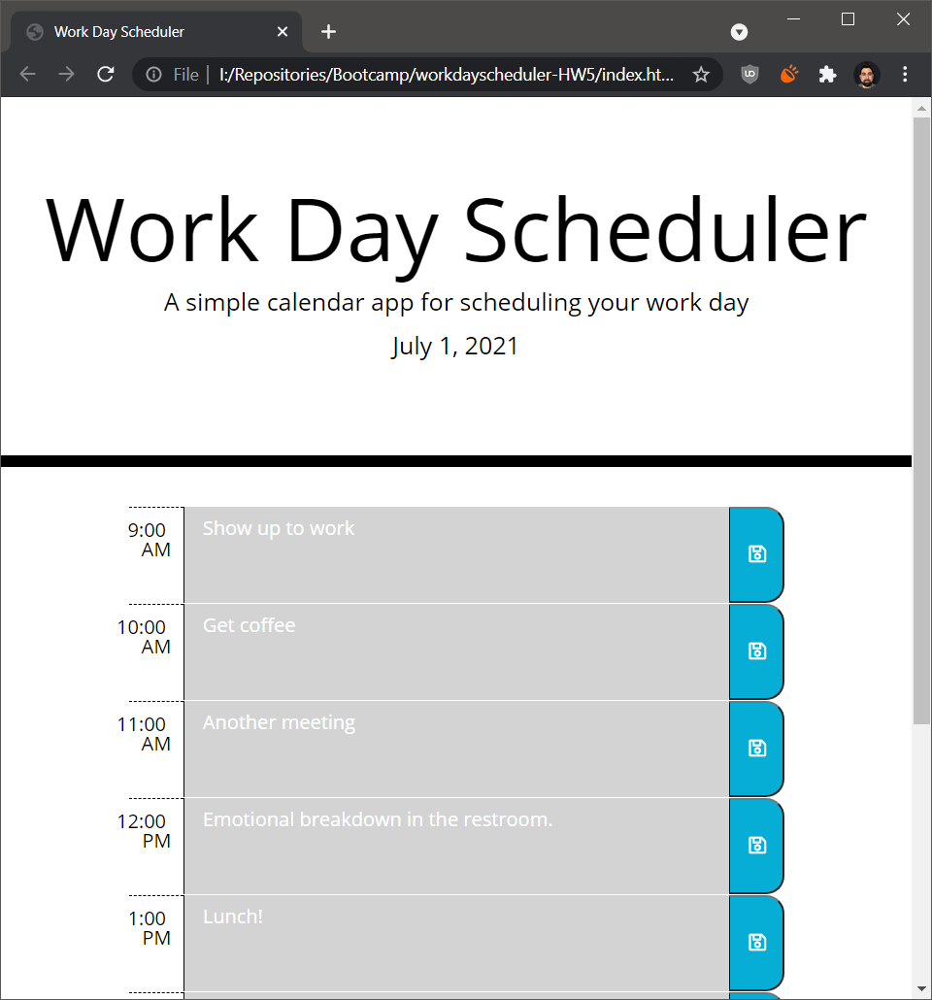

# workdayscheduler-HW5
## HW5 by David Lucio

*jQuery, Bootstrap, & Third-Party APIs*

>**UW Bootcamp Homework 05** 
Work Day Scheduler

- When user visits for the first time in a day
  - The current date is shown at the top
  - They are presented with an empty schedule
  - Current hour is colored red, past hours are colored grey, and future hours are colored green

- If the user clicks on an hour section
  - A text area allows them to write event details
  - If the corresponding save icon is clicked, the event details and related hour are stored in local storage
  - If it is not clicked, the event details are lost upon pzage exit or reload

- When the user revisits in the same day
    - The current date is shown at the top
    - If they previously saved data, it is loaded from local storage
    - Saved data is populated into its respective time slots

&nbsp;

*Assignment completed 7/1/21*: [Deployment Link](https://davidlucio.github.io/workdayscheduler-HW5/)

### **Screenshot of completed project:**

**REPO**: https://github.com/davidlucio/workdayscheduler-HW5